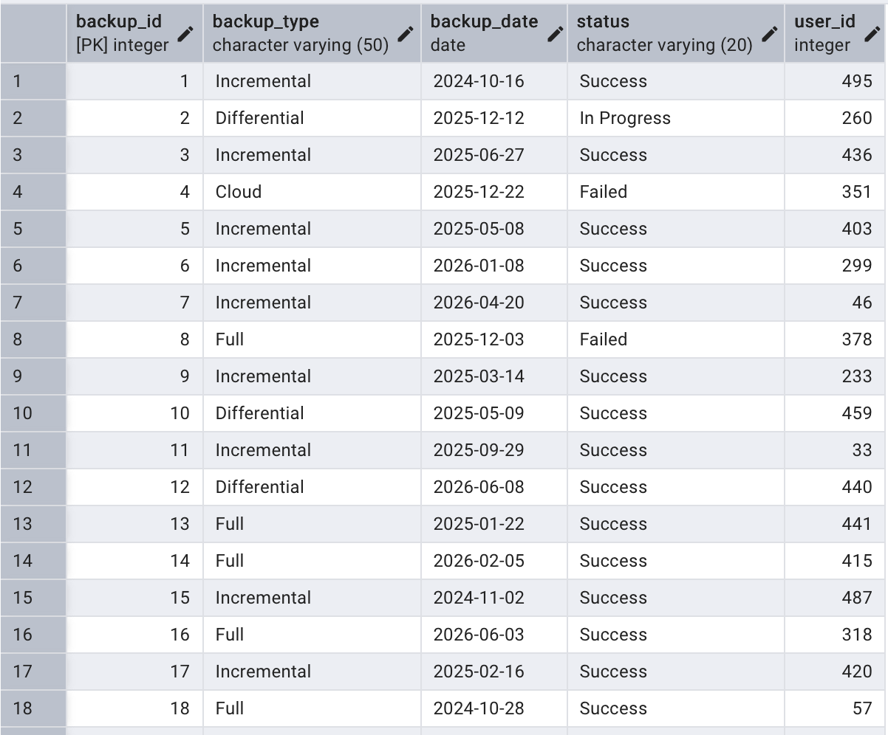

# Database Project – Phase A

## Submitted by

* Chagit Assulin – 215586769

## System Name

Hotel Security Management System

## Selected Unit

Security and Access Management Unit

---

## Table of Contents

1. Introduction
2. AI-Generated Screens
3. ERD and DSD Diagrams
4. Design Decisions
5. Data Insertion Methods
6. Backup and Restore

---

## Introduction

The system developed is a hotel security management system designed to provide control and monitoring of security-related activities.

The system stores data about:

* Users
* Roles
* Departments
* Access Logs
* CCTV Cameras
* Incidents
* IT Assets
* System Backups

The system enables:

* User and permission management
* Access tracking and logging
* Incident management
* Monitoring of cameras and assets
* System backup management

---

## AI-Generated Screens

The system screens were created using Google AI Studio and simulate the system’s user interface.

Link to the system:
https://ai.studio/apps/276def5c-3934-41e0-b326-b99f595f5350


---

## ERD and DSD Diagrams

### ERD


### DSD


---

## Design Decisions

During the database design process, the following decisions were made:

* Separation between Users, Roles, and Departments to maintain normalization
* Use of Foreign Keys to ensure data integrity
* Use of CHECK constraints to restrict allowed values, such as user status, asset status, camera status, access log status, and backup type
* Use of junction tables:

  * `incident_assignments` to link users and incidents
  * `asset_incident` to link assets and incidents

* Use of Primary Keys in all tables

* Use of `CREATE TABLE` statements with appropriate constraints, including:

  * `PRIMARY KEY`
  * `FOREIGN KEY`
  * `CHECK`
  * `NOT NULL`

---

## Tables Description

### USERS

Stores information about system users, including personal details, usernames, email addresses, account status, creation date, assigned role, and department affiliation.

### ROLES

Stores the different system roles, such as administrators, security managers, guards, technicians, and other operational roles.

### DEPARTMENTS

Stores organizational departments within the hotel security management environment.

### INCIDENTS

Stores security incidents reported in the system, including incident descriptions, report dates, reporting users, and related CCTV cameras.

### INCIDENT_ASSIGNMENTS

A junction table used to assign users to incidents and document each user’s responsibility or role within the incident.

### CCTV_CAMERAS

Stores information about CCTV cameras, including installation date, maintenance history, operational status, and physical location.

### LOCATIONS

Stores physical locations within the hotel or monitored facility.

### ACCESS_LOGS

Stores access activity records generated by the system, including access time, access status, the related user, and the camera associated with the event.

### IT_ASSETS

Stores information about IT and security-related assets, including asset type, asset name, purchase date, operational status, and location.

### ASSET_INCIDENT

A junction table linking IT assets to incidents in order to document which assets were involved in a specific security incident.

### SYSTEM_BACKUPS

Stores information about system backups, including backup date, backup type, and the user responsible for performing the backup.
---

## Data Insertion Methods

Three different data insertion methods were used in this project:

### Method 1 – Manual INSERT Statements

Data was inserted using SQL commands in:
insertTables.sql


---

### Method 2 – Programming (Python)

A Python script was developed:
generateData.py

The script generates:

* CSV files
* INSERT statements


---

### Method 3 – Importing from CSV Files
CSV files were generated using the Python data generation scripts.

After generating the files, the CSV files were placed inside the `init-db` directory, which is mounted into the PostgreSQL Docker container.

The data was imported into the database using the PostgreSQL `COPY` command inside the SQL initialization files.

Example:

```sql
COPY users(user_id, full_name, username, email, role_id, department_id, status, created_date)
FROM '/docker-entrypoint-initdb.d/users.csv'
DELIMITER ','
CSV HEADER;


---

### Data Volume

The following data volumes were inserted:

* At least 500 records in each table
* At least 20,000 records in the following tables:

  * access_logs
  * asset_incident


---

## Backup and Restore

Two backup methods were performed:

### Method 1 – Command Line

A backup was created using the PostgreSQL `pg_dump` command.

The backup file was saved as:

```text
backup_2026-04-28.sql```
---

### Method 2 – pgAdmin (UI)

A backup was created using the pgAdmin graphical interface.
This method allows creating a backup through the UI without writing terminal commands.


---
### Method 3 – Docker Initialization Files Backup

The project files themselves were used as an additional backup and recovery method.

The database schema, constraints, seed data, and CSV files were stored inside the project directory and automatically loaded into PostgreSQL through Docker initialization scripts.

This approach allows the entire database environment to be recreated from scratch by rebuilding the Docker container.

Main files used:

* `01-schema.sql`
* `02-seed-data.sql`
* CSV files in the `init-db` directory
* `docker-compose.yml`

This method ensures that both the database structure and the inserted data can be restored consistently in a new environment.


---

## Conclusion

At this stage, the database for the hotel security system was successfully created, data was inserted using three different methods, and backup and restore processes were verified.

The system enables efficient management of security data and supports future scalability.

