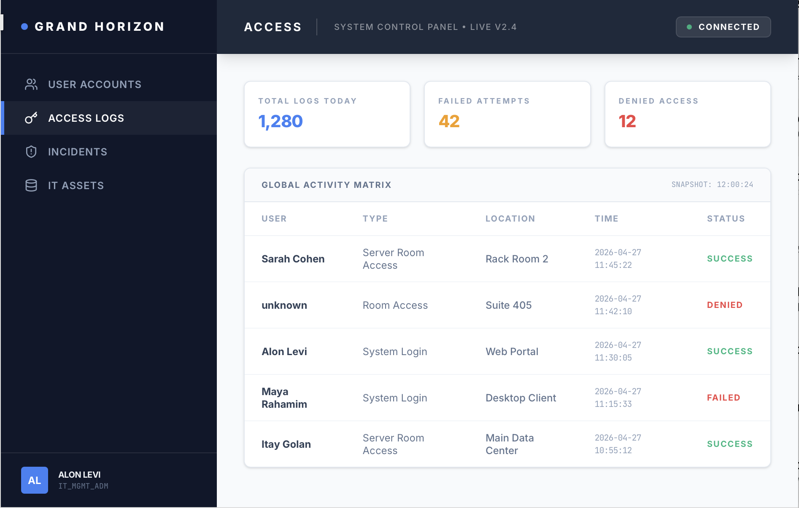
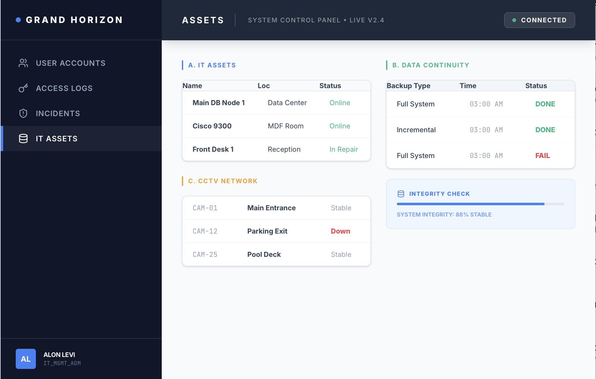
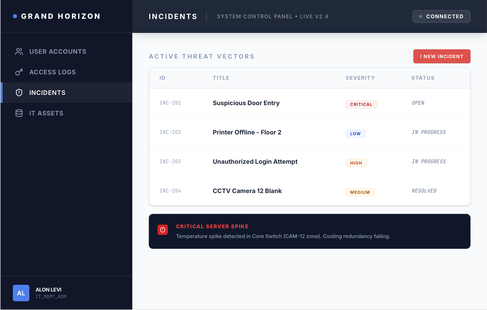
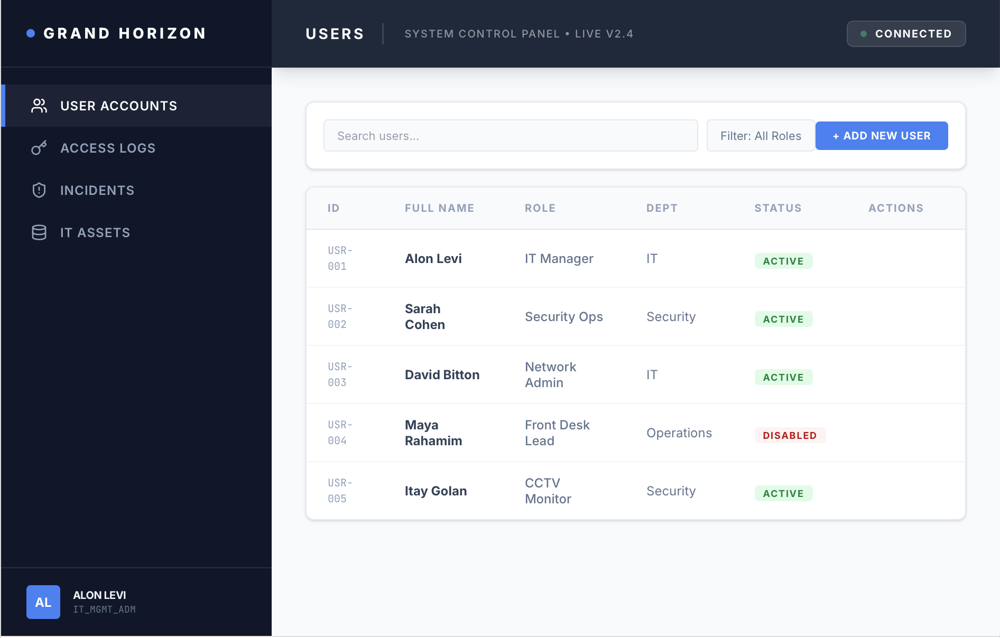
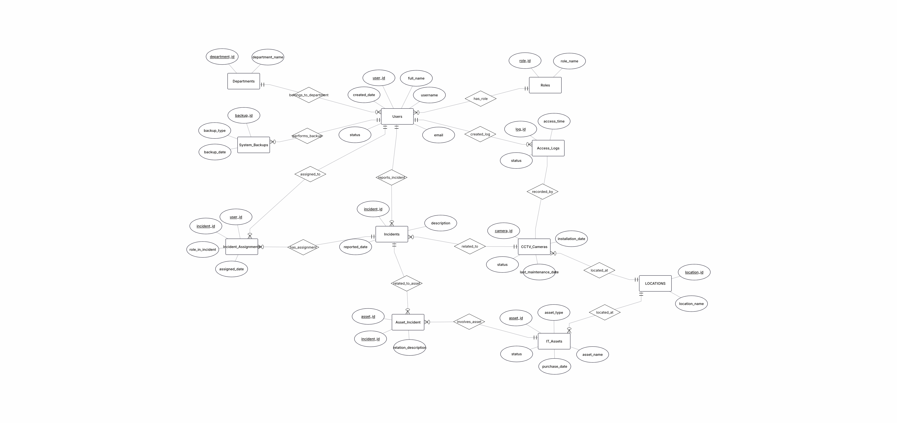
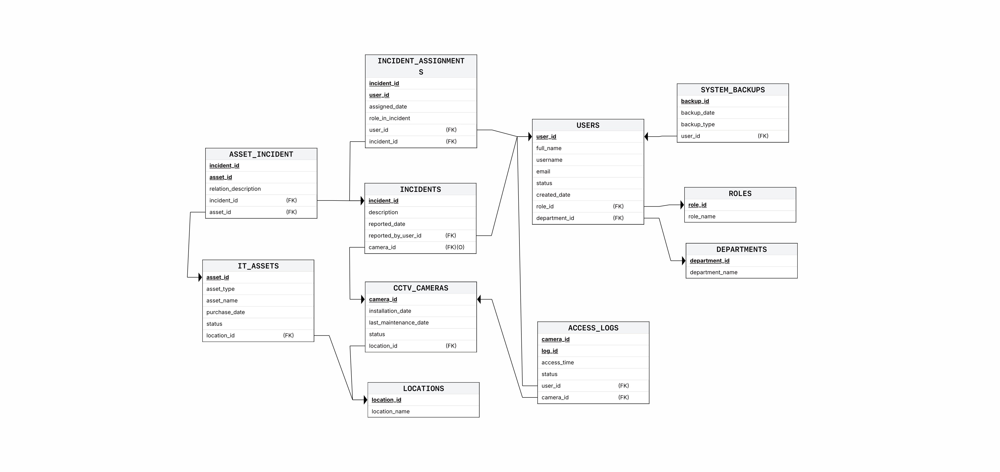
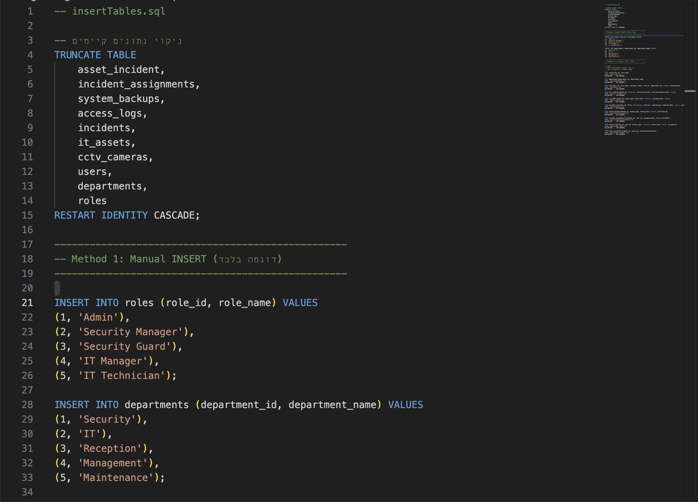
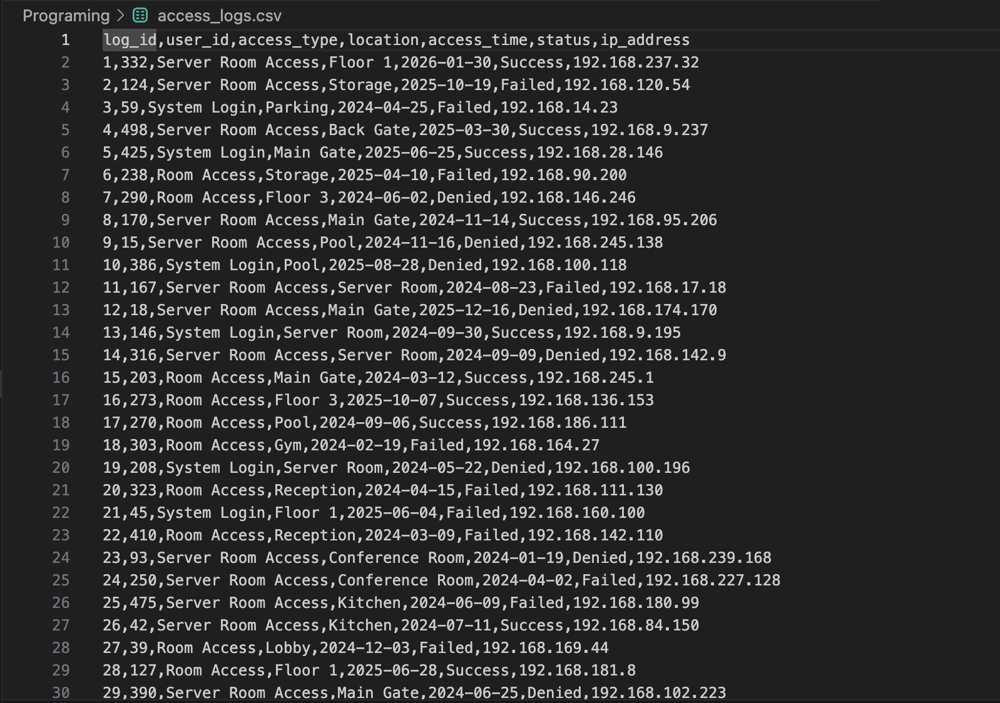
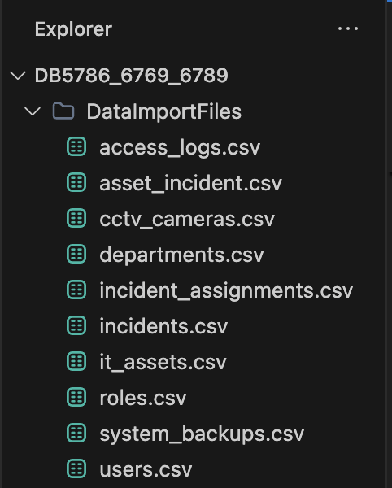
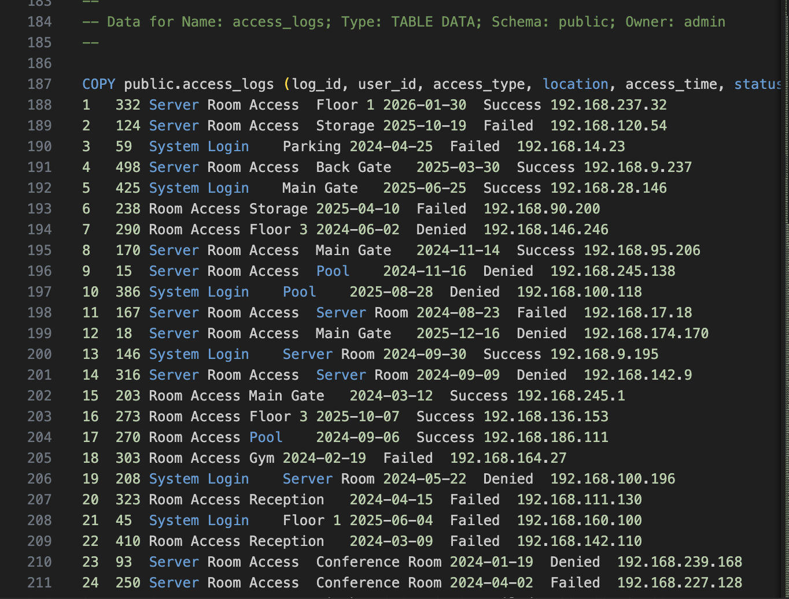

# Database Project – Phase A

## Submitted by

* Chagit Assulin – 215586769

## System Name

Hotel Security Management System

## Selected Unit

Security and Access Management Unit

---

## Table of Contents

1. Introduction
2. AI-Generated Screens
3. ERD and DSD Diagrams
4. Design Decisions
5. Data Insertion Methods
6. Backup and Restore

---

## Introduction

The system developed is a hotel security management system designed to provide control and monitoring of security-related activities.

The system stores data about:

* Users
* Roles
* Departments
* Access Logs
* CCTV Cameras
* Incidents
* IT Assets
* System Backups

The system enables:

* User and permission management
* Access tracking and logging
* Incident management
* Monitoring of cameras and assets
* System backup management

---

## AI-Generated Screens

The system screens were created using Google AI Studio and simulate the system’s user interface.

Link to the system:
https://ai.studio/apps/276def5c-3934-41e0-b326-b99f595f5350

---

## ERD and DSD Diagrams

### ERD

### DSD

---

## Design Decisions

During the database design process, the following decisions were made:

* Separation between Users, Roles, and Departments to maintain normalization
* Use of Foreign Keys to ensure data integrity
* Use of CHECK constraints to restrict values (such as statuses and access types)
* Use of junction tables:

  * incident_assignments to link users and incidents
  * asset_incident to link assets and incidents
* Use of Primary Keys in all tables

---

## Data Insertion Methods

Three different data insertion methods were used in this project:

### Method 1 – Manual INSERT Statements

Data was inserted using SQL commands in:
insertTables.sql

---

### Method 2 – Programming (Python)

A Python script was developed:
generateData.py

The script generates:

* CSV files
* INSERT statements

---

### Method 3 – Importing from CSV Files

CSV files were created for the tables, and data was inserted using the COPY command.

Example files:

* users.csv
* access_logs.csv
* asset_incident.csv

---

### Data Volume

The following data volumes were inserted:

* At least 500 records in each table
* At least 20,000 records in the following tables:

  * access_logs
  * asset_incident

---

## Backup and Restore

Two backup methods were performed:

### Method 1 – Command Line

Backup was performed using:

pg_dump

The backup file was saved as:
backup_2026-04-28.sql

---

### Method 2 – pgAdmin (UI)

Backup was performed using the pgAdmin graphical interface.

---

### Data Restore

The backup file was restored on another system, confirming that the database can be successfully recreated.

---

## Conclusion

At this stage, the database for the hotel security system was successfully created, data was inserted using three different methods, and backup and restore processes were verified.

The system enables efficient management of security data and supports future scalability.

